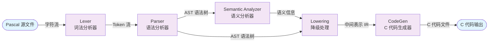

# Pascal-S2C
编译原理课设
BUPT

[TOC]

---

## 1. 模块划分与数据流图

### 1.1 整体架构

本项目采用经典的**多阶段编译器架构**，将 Pascal-S 源程序逐步转换为 C 代码。整体数据流如下：



### 1.2 模块与中间数据对应表

| 模块 | 输入数据 | 输出数据 |
|------|----------|----------|
| Lexer 词法分析器 | Pascal 源文件（字符流） | Token 流 |
| Parser 语法分析器 | Token 流 | 抽象语法树 (AST) |
| Semantic Analyzer 语义分析器 | AST | 语义信息 |
| Lowering 降级处理 | AST，语义信息 | 中间表示 (IR) |
| CodeGen C代码生成器 | IR | C 代码文件 |

---

## 2. 各模块功能详解

### 2.1 Lexer（词法分析器）

**源文件**：`src/lexer/lexer.cpp`

**核心类**：`LexerScanner`（内部实现类）

**功能**：

- **标识符与关键字识别**：
  - 标识符以字母或下划线开头，后续可包含字母、数字、下划线（`isIdentifierStart` / `isIdentifierPart`）
  - 通过将标识符转为小写后查表（`kKeywords`）区分关键字与普通标识符
  - 支持的关键字包括：`program`、`var`、`begin`、`end`、`if`、`then`、`else`、`while`、`function`、`procedure` 等 30 余个 Pascal 保留字

- **数字字面量**：
  - 整数：连续数字序列
  - 实数：整数部分 + `.` + 小数部分（如 `123.456`）
  - 注意：`..` 范围运算符会被单独处理，不与实数混淆

- **字符字面量**：
  - 单引号包围，如 `'A'`
  - 进行完整性检查：必须包含恰好一个字符，且正确闭合

- **运算符与符号**：
  - 单字符符号：`+` `-` `*` `/` `=` `<` `>` `,` `;` `(` `)` `[` `]` `.`
  - 双字符符号：`:=`（赋值）、`<=`、`>=`、`<>`（不等于）、`..`（范围）

- **注释处理**（支持三种 Pascal 注释风格）：
  - 花括号注释：`{ ... }`
  - 括号星号注释：`(* ... *)`
  - 行注释：`// ...`（类 C++ 风格，Pascal 扩展）
  - 注释嵌套未实现，但会检测未闭合注释并抛出错误

- **空白字符处理**：
  - 跳过空格、制表符、回车、换行符
  - 换行时更新行列位置（用于错误定位）

**关键接口**：

```cpp
// 公开接口
TokenList Lexer::tokenize(const std::string& source) const;

// 内部核心扫描函数
TokenList LexerScanner::scan();
```

**错误处理**：
- 遇到非法字符抛出 `CompilerError`
- 未闭合的注释抛出错误并报告位置
- 字符字面量格式错误时抛出异常

**值得注意的实现细节**：
- 关键字与标识符识别采用**小写归一化**策略，使语言大小写不敏感
- 前瞻字符（`peek()` / `peekNext()`），使词法分析可以在不消费字符的情况下预判 Token 类型（如区分 `:` 和 `:=`），避免了回溯，使代码简洁高效。
- 位置跟踪（`SourceLocation`）为后续错误报告提供精确的行列信息

---

### 2.2 Parser（语法分析器）

**源文件**：`src/parser/parser.cpp`

**核心类**：`ParserImpl`（递归下降解析器）

**功能**：

- **分析方法**：**递归下降（Recursive Descent）**，每个语法结构对应一个解析函数
  - 采用 LL(1) 风格，通过 `peek()`/`check()` 前瞻一个 Token 决定分支
  - 表达式解析采用**优先级爬升（Pratt Parser）** 风格，分层处理：`parseExpression` → `parseAdditiveExpression` → `parseMultiplicativeExpression` → `parseUnaryExpression` → `parsePrimaryExpression`

- **支持的 Pascal 语法结构**：
  | 结构 | 解析函数 | 说明 |
  |------|----------|------|
  | 程序头 | `parseProgramHeaderElement` | 支持 `program name (input, output);` 格式 |
  | 常量声明 | `parseConstDeclarations` | `const name = value;` |
  | 变量声明 | `parseVarDeclarations` | `var name1, name2 : type;` |
  | 类型声明 | 未实现 | 遇到 `type` 会抛出错误 |
  | 数组类型 | `parseType` | `array [1..10] of integer`，支持多维 |
  | 记录类型 | 未实现 | - |
  | 函数/过程 | `parseSubprogram` | 支持函数和过程，含参数列表 |
  | 复合语句 | `parseCompoundStatement` | `begin ... end` |
  | 赋值语句 | `parseIdentifierLedStatement` | `var := expr`，支持数组元素赋值 |
  | 条件语句 | `parseIfStatement` | `if cond then stmt [else stmt]` |
  | 循环语句 | `parseWhileStatement` / `parseForStatement` | `while` 已实现，`for` 部分实现（仅 `to`，`downto` 未实现） |
  | 过程调用 | `parseIdentifierLedStatement` / `parseCallStatement` | 无参数或带参数调用 |
  | 输入输出 | `parseReadStatement` / `parseWriteStatement` | `read(x, y)`，`write(expr, ...)` |

- **错误处理机制**：
  - 使用 `expect(TokenKind, message)` 检查预期 Token，若不匹配则抛出 `CompilerError`
  - 错误信息包含位置（`current().location`），便于定位
  - 未实现的功能（如 `type` 声明、`downto`）也会抛出明确错误
  - 没有实现错误恢复（fail-fast 策略），遇到错误即终止

**关键接口**：

```cpp
// 公开接口：从 Token 流解析为 AST
ProgramPtr Parser::parse(const TokenList& tokens) const;

// 核心解析入口
ProgramPtr ParserImpl::parseProgram();

// 主要解析函数
std::unique_ptr<BlockNode> parseBlock();
std::unique_ptr<Stmt> parseStatement();
std::unique_ptr<Expr> parseExpression();
std::unique_ptr<Expr> parseAdditiveExpression();
std::unique_ptr<Expr> parseMultiplicativeExpression();
std::unique_ptr<Expr> parseUnaryExpression();
std::unique_ptr<Expr> parsePrimaryExpression();
```

**表达式优先级层次**：

| 优先级 | 层级 | 运算符 |
|--------|------|--------|
| 最低 | `parseExpression` | 关系运算符：`=`, `<>`, `<`, `<=`, `>`, `>=` |
| 中 | `parseAdditiveExpression` | `+`, `-`, `or` |
| 较高 | `parseMultiplicativeExpression` | `*`, `/`, `div`, `mod`, `and` |
| 高 | `parseUnaryExpression` | `+`, `-`, `not` |
| 最高 | `parsePrimaryExpression` | 字面量、标识符、括号表达式 |

**值得注意的实现细节**：
- **参数传递模式**：`ParamPassMode` 区分值传递和引用传递（`var` 参数）
- **数组索引**：支持多维数组，通过 `parseExpressionList` 解析多个索引表达式
- **标识符引导的歧义处理**：`parseIdentifierLedStatement` 通过前瞻区分赋值、调用还是数组索引
- **语句中的空语句处理**：遇到 `;`、`end`、`else`、`until` 时返回空语句，简化循环/条件中的语句解析

---

### 2.3 Semantic Analyzer（语义分析器）

**源文件**：`src/semantic/analyzer.cpp`

**核心类**：`AnalyzerImpl`（语义分析实现）

**功能**：

- **符号表组织**：
  - 采用**作用域树（Scope Tree）** 结构，每个作用域包含指向父作用域的指针
  - 支持嵌套作用域（如子程序内部可以访问外层符号）
  - 符号表条目（`Symbol`）包含：名称、种类（常量/变量/参数/函数/过程）、类型、是否为全局、是否为 var 参数
  - 函数/过程符号还包含参数列表（`SymbolParameter`）

- **作用域分析**：
  - 全局作用域：`analyzeProgram` 创建并作为根作用域
  - 子程序作用域：`analyzeSubprogramBodies` 为每个子程序创建子作用域
  - 符号查找：`resolveSymbol` 从当前作用域向上递归查找，支持词法作用域

- **类型检查规则**：

  | 检查项 | 规则 | 实现函数 |
  |--------|------|----------|
  | 赋值兼容 | 类型相同，或 `integer` 可赋值给 `real` | `isAssignmentCompatible` |
  | 算术运算 | 操作数必须为数值类型（integer/real），结果类型自动提升 | `analyzeBinaryType` |
  | 除法 `/` | 总是返回 `real` | `analyzeBinaryType` |
  | `div`/`mod` | 操作数必须为 `integer` | `analyzeBinaryType` |
  | 关系运算 | 返回 `boolean` | `analyzeBinaryType` |
  | 逻辑运算 | 操作数为 `boolean` 或 `integer` | `analyzeBinaryType` |
  | 一元运算 | `+`/`-` 要求数值，`not` 要求 boolean 或 integer | `analyzeUnaryType` |
  | 函数调用 | 参数数量、类型必须与声明匹配 | `analyzeCallArguments` |
  | 数组索引 | 索引数量必须与维度匹配 | `analyzeLValue`/`analyzeExpression` |
  | For 循环变量 | 必须为 `integer` 类型 | `analyzeStatement` |

- **符号种类与可赋值性**：
  | 符号种类 | 可作为 LValue（赋值目标） | 可作为表达式 |
  |----------|--------------------------|--------------|
  | 变量 (`Variable`) | ✅ | ✅ |
  | 参数 (`Parameter`) | ✅（非 var 参数？实际允许） | ✅ |
  | 常量 (`Constant`) | ❌ | ✅ |
  | 函数 (`Function`) | ❌ | ✅（调用时） |
  | 过程 (`Procedure`) | ❌ | ❌（仅作为语句调用） |

- **语义分析结果**（`SemanticContext`）：
  - `globalScope`：全局作用域指针
  - `ownedScopes`：所有作用域的所有权容器
  - `expressionTypes`：每个表达式节点对应的类型映射
  - `variableBindings`：变量/参数节点对应的符号映射
  - `indexBindings`：数组索引节点对应的符号映射
  - `callStmtBindings` / `callExprBindings`：调用节点对应的符号映射
  - `entryProgramName`：程序名

**关键接口**：

```cpp
// 公开接口：对 AST 进行语义分析，返回带标注的语义上下文
SemanticContext SemanticAnalyzer::analyze(const ProgramNode& program) const;

// 核心分析函数
void AnalyzerImpl::analyzeProgram(const ProgramNode& program);
void AnalyzerImpl::analyzeBlock(const BlockNode& block, Scope& scope, bool isGlobalScope);
TypeInfo AnalyzerImpl::analyzeExpression(const Expr& expr, Scope& scope);
TypeInfo AnalyzerImpl::analyzeLValue(const Expr& expr, Scope& scope);
void AnalyzerImpl::analyzeStatement(const Stmt& stmt, Scope& scope);
```

**值得注意的实现细节**：
- **两遍处理**：子程序先声明后分析（`declareSubprogramHeaders` 先注册符号，`analyzeSubprogramBodies` 后分析函数体），支持递归调用
- **类型自动提升**：`integer` + `real` 的结果自动提升为 `real`
- **数组类型**：`TypeInfo` 中保存维度信息，便于后续代码生成分配空间
- **语义绑定存储**：将分析结果（类型、符号）存储在 `SemanticContext` 的映射中，供后续阶段（Lowering、CodeGen）使用，避免重复分析

---

### 2.4 Lowering（降级处理）

**源文件**：`src/lower/lower.cpp`

**核心类**：`LoweringPass`

**功能**：

- **当前实现状态**：**这是一个占位实现（Stub）**
  - 目前仅将 `ProgramNode` 和 `SemanticContext` 的指针打包到 `LoweredProgramView` 中
  - **没有进行实际的 AST 转换或 IR 生成**

- **设计意图**（从接口推测）：
  - 预期将带有语义标注的 AST 转换为更简单的**中间表示（IR）**
  - 可能的简化工作包括：
    - 消除语法糖（如 `for` 循环转换为 `while` 循环）
    - 展平表达式（将复杂表达式拆分为临时变量）
    - 统一类型表示（如将 Pascal 的 `real` 映射为 C 的 `double`）
    - 简化控制流（生成三地址码或类似结构）

- **为什么需要这个阶段**：
  - **解耦**：将前端（Pascal 语法）与后端（C 代码生成）分离，便于支持多种后端
  - **简化代码生成**：IR 通常比 AST 更规整，更容易映射到目标语言
  - **优化机会**：在 IR 层面可以进行平台无关的优化（如常量折叠、死代码消除）

**当前实现代码**：

```cpp
LoweredProgramView LoweringPass::lower(const ProgramNode &program, 
                                       const SemanticContext &semantic) const
{
    LoweredProgramView view;
    view.program = &program;      // 直接保存指针，无转换
    view.semantic = &semantic;    // 直接保存指针，无转换
    return view;
}
```

**值得注意的点**：
- 当前 Lowering 阶段是**透传（Passthrough）**，直接将 AST 和语义信息传递给代码生成器
- 这意味着 `CCodeGenerator` 目前直接消费 AST + `SemanticContext`，而非独立的 IR
- 这种设计简化了实现，但将类型映射、控制流转换等逻辑全部放在了代码生成阶段
- 后续可以扩展 `lower()` 函数，真正生成中间表示，使架构更加清晰

**与架构图中的对应关系**：

- 在数据流图中，Lowering 阶段标为"中间表示 IR"
- 实际当前实现中，IR 就是"带语义标注的 AST + 语义上下文"的封装
- 这是一个**可扩展的设计**，未来可以在此阶段插入真正的 IR 生成

---

### 2.5 CodeGen（C 代码生成器）

**源文件**：`src/codegen/c_codegen.cpp`、`src/codegen/c_writer.cpp`

**核心类**：`CodegenImpl`

**功能**：

- **映射策略**：将带语义标注的 AST（通过 `LoweredProgramView`）直接转换为 C 代码
  - 类型映射：Pascal → C
    | Pascal 类型 | C 类型 |
    |-------------|--------|
    | `integer` | `int` |
    | `real` | `float` |
    | `boolean` | `bool`（需 `<stdbool.h>`） |
    | `char` | `char` |
  - 数组：Pascal 数组 `array [L..U] of T` → C 数组 `T name[U-L+1]`
    - 访问时自动处理下标偏移（减去 `lower`）
  - 变量传递：
    - 普通参数：值传递
    - `var` 参数：编译为指针传递，使用时自动解引用

- **控制流转换**：
  | Pascal 结构 | C 输出 |
  |-------------|--------|
  | `if cond then stmt` | `if (cond) stmt` |
  | `if ... else ...` | `if ... else ...` |
  | `while cond do stmt` | `while (cond) stmt` |
  | `for var := start to stop do stmt` | `for (var = start; var <= stop; var++)` |
  | `begin ... end` | `{ ... }`（复合语句） |
  | `read(x)` | `scanf("%d", &x)`（类型对应格式符） |
  | `write(x, y)` | `printf("%d%f", x, y)` |

- **函数/过程转换**：
  - 函数 → 返回对应类型的 C 函数，内部使用 `_` 变量存储返回值
  - 过程 → `void` 函数
  - 参数列表按类型转换，`var` 参数转为指针
  - **限制**：不支持嵌套子程序（遇到会抛出异常）

- **表达式转换**：
  - 采用**优先级感知的渲染**（类似 Pratt Parser 的逆过程）
  - 通过 `precedence` 比较决定是否添加括号
  - 特殊处理：
    - `not` → `!`（布尔）或 `~`（整数）
    - `/`（实数除法）→ `/`，并自动将整数操作数转换为 `float`
    - `div`/`mod` → `/`/`%`
    - `and`/`or` → `&&`/`||`（布尔）或 `&`/`|`（整数）

- **生成的 C 代码风格**：
  - 包含必要的头文件（`<stdio.h>`，按需包含 `<stdbool.h>`）
  - 全局常量使用 `const` 声明
  - 全局变量和局部变量按作用域输出
  - 主函数 `main()` 包含程序体的所有语句
  - 代码缩进清晰（通过 `CWriter` 管理）

**关键接口**：

```cpp
// 公开接口：从 LoweredProgramView 生成 C 代码
std::string CCodeGenerator::generate(const LoweredProgramView& program) const;

// 核心生成函数
std::string CodegenImpl::generate();                    // 主入口
void emitIncludes();                                    // 输出头文件
void emitGlobalDeclarations();                          // 全局常量/变量
void emitTopLevelSubprograms();                         // 函数/过程定义
void emitMain();                                        // main 函数
void emitSubprogram(const SubprogramDeclNode&);         // 子程序定义
void emitStatement(const Stmt&, const FunctionContext*); // 语句生成
RenderedExpr renderExpr(const Expr&, const FunctionContext*) const; // 表达式生成
```

**优先级常量**（用于表达式括号控制）：

| 优先级 | 值 | 运算符 |
|--------|-----|--------|
| Primary | 100 | 字面量、变量、函数调用 |
| Unary | 90 | `+` `-` `!` `~` |
| Multiplicative | 80 | `*` `/` `%` |
| Additive | 70 | `+` `-` |
| Relational | 60 | `<` `<=` `>` `>=` |
| Equality | 50 | `==` `!=` |
| Bitwise And | 40 | `&` |
| Bitwise Or | 30 | `|` |
| Logical And | 20 | `&&` |
| Logical Or | 10 | `||` |

**值得注意的实现细节**：

| 特性 | 实现方式 |
|------|----------|
| **返回值处理** | 函数内部使用 `_` 临时变量存储返回值，最后 `return _;` |
| **数组下标偏移** | 若数组下界非 0，访问时自动生成 `(index - lower)` |
| **var 参数** | 参数类型变为 `T*`，使用时自动解引用，传递时自动取地址 |
| **布尔类型** | 若程序使用 `boolean`，自动包含 `<stdbool.h>`，否则避免引入 |
| **整数提升** | 在 `/` 除法中，整数操作数自动转换为 `float` |
| **逻辑/位运算区分** | `and`/`or` 根据操作数类型输出 `&&`/`||` 或 `&`/`|` |
| **嵌套函数** | 明确不支持，遇到会抛出异常 |

**生成的代码示例**（假设输入 Pascal 程序）：

```pascal
program Example;
var a: integer;
begin
    a := 1 + 2 * 3;
    write(a)
end.
```

生成 C 代码大致为：

```c
#include <stdio.h>

int main()
{
    int a;
    a = 1 + 2 * 3;
    printf("%d", a);
    return 0;
}
```

---

## 3. 模块间数据结构

### 3.1 Token（词法单元）

**定义位置**：`src/common/token.h`（或 `src/lexer/token.h`）

```cpp
struct Token
{
    TokenKind kind = TokenKind::EndOfFile;
    std::string lexeme;
    SourceLocation location;
};

using TokenList = std::vector<Token>;
```

**字段说明**：

| 字段 | 类型 | 说明 |
|------|------|------|
| `kind` | `TokenKind` | 词法单元的类型（关键字、标识符、字面量、运算符等） |
| `lexeme` | `std::string` | 原始词素（源代码中匹配的字符串，如 `"if"`、`"123"`、`":="`） |
| `location` | `SourceLocation` | 该 Token 在源文件中的位置（行号、列号），用于错误报告 |

---

#### TokenKind 枚举分类

| 类别 | 包含的 TokenKind | 说明 |
|------|------------------|------|
| **字面量** | `Identifier`, `IntegerLiteral`, `RealLiteral`, `CharLiteral` | 标识符和各种字面量 |
| **关键字** | `Program`, `Const`, `Var`, `Type`, `Record`, `Array`, `Of`, `Begin`, `End`, `Function`, `Procedure`, `Integer`, `Real`, `Boolean`, `Char`, `If`, `Then`, `Else`, `While`, `Do`, `For`, `To`, `Downto`, `Case`, `Repeat`, `Until`, `Read`, `Write`, `Div`, `Mod`, `And`, `Or`, `Not`, `True`, `False` | Pascal 保留字 |
| **赋值/关系** | `Assign` (`:=`), `Equal` (`=`), `NotEqual` (`<>`), `Less` (`<`), `LessEqual` (`<=`), `Greater` (`>`), `GreaterEqual` (`>=`) | 赋值和关系运算符 |
| **算术运算符** | `Plus` (`+`), `Minus` (`-`), `Star` (`*`), `Slash` (`/`) | 基本算术运算 |
| **分隔符** | `Comma` (`,`), `Semicolon` (`;`), `Colon` (`:`), `Dot` (`.`), `Range` (`..`) | 标点符号 |
| **括号/括号类** | `LParen` (`(`), `RParen` (`)`), `LBracket` (`[`), `RBracket` (`]`) | 括号和方括号 |
| **特殊** | `EndOfFile` | 文件结束标记 |

---

#### Token 示例

| 源码片段 | Token 对象 |
|----------|------------|
| `program` | `{kind: Program, lexeme: "program", location: {1,1}}` |
| `x123` | `{kind: Identifier, lexeme: "x123", location: {1,8}}` |
| `:=` | `{kind: Assign, lexeme: ":=", location: {1,10}}` |
| `123` | `{kind: IntegerLiteral, lexeme: "123", location: {1,13}}` |
| `'A'` | `{kind: CharLiteral, lexeme: "'A'", location: {1,16}}` |

---

#### 辅助函数

```cpp
// 将 TokenKind 转换为可读的字符串（用于调试和错误报告）
const char* tokenKindName(TokenKind kind);
```

---

### 3.2 AST（抽象语法树）

**定义位置**：`src/ast/ast.h`

**节点继承体系**：

```
Node (基类)
├── TypeNode (类型节点)
│   ├── ScalarTypeNode (标量类型: integer, real, boolean, char)
│   └── ArrayTypeNode (数组类型)
├── Expr (表达式节点)
│   ├── BinaryExprNode (二元运算)
│   ├── UnaryExprNode (一元运算)
│   ├── CallExprNode (函数调用)
│   ├── VarExprNode (变量引用)
│   ├── IndexExprNode (数组元素访问)
│   └── LiteralExprNode (字面量)
├── Stmt (语句节点)
│   ├── CompoundStmtNode (复合语句 begin...end)
│   ├── AssignStmtNode (赋值)
│   ├── CallStmtNode (过程调用)
│   ├── IfStmtNode (条件语句)
│   ├── WhileStmtNode (循环)
│   ├── ForStmtNode (for 循环)
│   ├── ReadStmtNode (读语句)
│   └── WriteStmtNode (写语句)
├── Decl (声明节点)
│   ├── ConstDeclNode (常量声明)
│   ├── VarDeclNode (变量声明)
│   └── SubprogramDeclNode (子程序声明)
│       ├── FunctionDeclNode (函数)
│       └── ProcedureDeclNode (过程)
└── BlockNode (块: 包含声明和语句)
    └── ProgramNode (整个程序)
```

**节点基类**：

```cpp
struct Node
{
    SourceLocation loc{};   // 所有节点都有位置信息
    virtual ~Node() = default;
};

struct Expr : Node {};      // 表达式基类
struct Stmt : Node {};      // 语句基类
struct Decl : Node {};      // 声明基类
```

**主要节点类型**：

| 类别 | 节点类型 | 作用 | 关键字段 |
|------|----------|------|----------|
| **程序结构** | `ProgramNode` | 整个 Pascal 程序 | `name`, `block` |
| | `BlockNode` | 程序块（作用域） | `constDecls`, `varDecls`, `subprograms`, `body` |
| **声明** | `ConstDeclNode` | 常量声明 `const x = 10;` | `name`, `value` |
| | `VarDeclNode` | 变量声明 `var a, b: integer;` | `names`, `type` |
| | `ParamDeclNode` | 参数声明 | `names`, `type`, `passMode` |
| | `FunctionDeclNode` | 函数声明 | `name`, `params`, `returnType`, `block` |
| | `ProcedureDeclNode` | 过程声明 | `name`, `params`, `block` |
| **类型** | `ScalarTypeNode` | 标量类型 | `kind` (Integer/Real/Boolean/Char) |
| | `ArrayTypeNode` | 数组类型 | `dims` (各维上下界), `elementType` |
| **语句** | `CompoundStmtNode` | 复合语句 `begin ... end` | `statements` |
| | `AssignStmtNode` | 赋值语句 `a := b + 1` | `target`, `value` |
| | `CallStmtNode` | 过程调用 `foo(x, y)` | `name`, `args` |
| | `IfStmtNode` | 条件语句 | `condition`, `thenBranch`, `elseBranch` |
| | `WhileStmtNode` | while 循环 | `condition`, `body` |
| | `ForStmtNode` | for 循环 | `varName`, `start`, `stop`, `body` |
| | `ReadStmtNode` | 读语句 `read(a, b)` | `targets` |
| | `WriteStmtNode` | 写语句 `write(x, y)` | `values` |
| **表达式** | `BinaryExprNode` | 二元运算 `a + b` | `op`, `lhs`, `rhs` |
| | `UnaryExprNode` | 一元运算 `-x`, `not b` | `op`, `operand` |
| | `CallExprNode` | 函数调用 `foo(x)` | `name`, `args` |
| | `VarExprNode` | 变量引用 `a` | `name` |
| | `IndexExprNode` | 数组元素 `arr[i][j]` | `baseName`, `indices` |
| | `LiteralExprNode` | 字面量 `123`, `'A'`, `true` | `kind`, `rawText` |

---

**示例**：以表达式 `a + b * 2` 为例，AST 结构为：

```
      BinaryExprNode (op=Add)
      /              \
VarExprNode      BinaryExprNode (op=Mul)
(name="a")        /              \
          VarExprNode        LiteralExprNode
          (name="b")         (kind=Int, rawText="2")
```

**示例**：以 Pascal 程序片段为例：

```pascal
var x: integer;
begin
    x := 1 + 2 * 3;
    write(x)
end.
```

对应的 AST 结构（简化）：

```
ProgramNode (name="Example")
└── BlockNode
    ├── varDecls: [VarDeclNode(names=["x"], type=ScalarTypeNode(Integer))]
    └── body: CompoundStmtNode
        └── statements:
            ├── AssignStmtNode
            │   ├── target: VarExprNode(name="x")
            │   └── value: BinaryExprNode(op=Add)
            │       ├── lhs: LiteralExprNode(1)
            │       └── rhs: BinaryExprNode(op=Mul)
            │           ├── lhs: LiteralExprNode(2)
            │           └── rhs: LiteralExprNode(3)
            └── WriteStmtNode
                └── values: [VarExprNode(name="x")]
```

---

#### 运算符枚举

**二元运算符** (`BinaryOp`)：

| 类别 | 运算符 | 对应 Pascal 符号 |
|------|--------|------------------|
| 算术 | `Add`, `Sub`, `Mul`, `RealDiv`, `IntDiv`, `Mod` | `+`, `-`, `*`, `/`, `div`, `mod` |
| 关系 | `Eq`, `Ne`, `Lt`, `Le`, `Gt`, `Ge` | `=`, `<>`, `<`, `<=`, `>`, `>=` |
| 逻辑 | `And`, `Or` | `and`, `or` |

**一元运算符** (`UnaryOp`)：
- `Plus`: `+`（正号）
- `Minus`: `-`（负号）
- `Not`: `not`（逻辑非）

---

### 3.3 语义信息（Symbol Table & Semantic Context）

**定义位置**：
- `src/semantic/type.h` - 类型系统
- `src/semantic/symbol.h` - 符号定义
- `src/semantic/scope.h` - 作用域
- `src/semantic/analyzer.h` - 语义上下文

---

#### 3.3.1 类型系统（TypeInfo）

```cpp
struct TypeInfo
{
    BasicTypeKind basic = BasicTypeKind::Void;  // 基本类型
    bool isArray = false;                        // 是否为数组
    std::vector<ArrayBound> dims;                // 数组各维度的上下界
};

// ArrayBound 定义在 ast.h 中
struct ArrayBound
{
    int lower = 0;   // 下界
    int upper = 0;   // 上界
};
```

**基本类型枚举**（`BasicTypeKind`）：

| 值 | 说明 |
|----|------|
| `Integer` | 整数类型 |
| `Real` | 实数类型 |
| `Boolean` | 布尔类型 |
| `Char` | 字符类型 |
| `Void` | 无类型（用于过程或无返回值） |

**类型辅助函数**：

| 函数 | 作用 |
|------|------|
| `makeScalarType(kind)` | 创建标量类型 |
| `makeArrayType(elementKind, dims)` | 创建数组类型 |
| `sameType(lhs, rhs)` | 判断两个类型是否相同 |
| `isNumericType(type)` | 判断是否为数值类型（integer/real） |
| `isBooleanType(type)` | 判断是否为布尔类型 |
| `arrayElementType(type)` | 获取数组的元素类型 |

---

#### 3.3.2 符号（Symbol）

```cpp
struct SymbolParameter
{
    TypeInfo type;   // 参数类型
    bool isVar = false;  // 是否为 var 参数（传引用）
};

struct Symbol
{
    std::string name;                    // 符号名称
    SymbolKind kind = SymbolKind::Variable;  // 符号种类
    TypeInfo type;                       // 数据类型
    bool isGlobal = false;               // 是否为全局符号
    bool isVarParameter = false;         // 是否为 var 参数
    std::vector<SymbolParameter> parameters;  // 函数/过程的参数列表
};
```

**符号种类枚举**（`SymbolKind`）：

| 值 | 说明 |
|----|------|
| `Constant` | 常量 |
| `Variable` | 变量 |
| `Parameter` | 参数 |
| `Function` | 函数 |
| `Procedure` | 过程 |

**符号辅助函数**：

| 函数 | 作用 |
|------|------|
| `isCallableSymbol(symbol)` | 判断是否为可调用符号（函数或过程） |
| `isAssignableSymbol(symbol)` | 判断是否为可赋值符号（变量、参数、函数） |

---

#### 3.3.3 作用域（Scope）

```cpp
class Scope
{
public:
    explicit Scope(const Scope* parent = nullptr);  // 可指定父作用域

    bool define(Symbol symbol);                      // 定义符号，返回 false 表示重复定义
    const Symbol* lookup(const std::string& name) const;    // 向上递归查找
    const Symbol* lookupLocal(const std::string& name) const; // 仅查找当前作用域
    const std::unordered_map<std::string, Symbol>& symbols() const;
    const Scope* parent() const;
};
```

**作用域特性**：
- 采用**链式作用域**（通过 `parent_` 指针形成作用域树）
- 支持嵌套（如子程序内部可以访问外层符号）
- 符号查找从当前作用域向上递归，直到全局作用域

---

#### 3.3.4 语义上下文（SemanticContext）

```cpp
struct SemanticContext
{
    std::string entryProgramName;                              // 程序名称
    std::vector<std::unique_ptr<Scope>> ownedScopes;           // 所有作用域的所有权
    const Scope* globalScope = nullptr;                        // 全局作用域指针

    // 语义分析结果映射
    std::unordered_map<const Expr*, TypeInfo> expressionTypes;   // 每个表达式的类型
    std::unordered_map<const VarExprNode*, const Symbol*> variableBindings;   // 变量引用 → 符号
    std::unordered_map<const IndexExprNode*, const Symbol*> indexBindings;    // 数组索引 → 符号
    std::unordered_map<const CallExprNode*, const Symbol*> callExprBindings;  // 函数调用 → 符号
    std::unordered_map<const CallStmtNode*, const Symbol*> callStmtBindings;  // 过程调用 → 符号
};
```

**设计说明**：
- 语义分析的结果以**映射表**形式存储在 `SemanticContext` 中
- 每个 AST 节点通过指针关联其类型和绑定的符号
- 后续阶段（Lowering、CodeGen）通过这些映射获取语义信息，无需重复分析
- `ownedScopes` 存储所有作用域的 `unique_ptr`，确保内存管理

---

#### 3.3.5 语义信息数据流示例

以表达式 `x := y + 1` 为例：

```
AST 节点                        语义映射
────────────────────────────────────────────────────
VarExprNode("x")      →  variableBindings: {x → Symbol(x, Variable, Integer)}
VarExprNode("y")      →  variableBindings: {y → Symbol(y, Variable, Integer)}
LiteralExprNode("1")  →  expressionTypes: {1 → Integer}
BinaryExprNode(+)     →  expressionTypes: {+ → Integer}
AssignStmtNode        →  (类型检查通过)
```

**整体架构关系**：

```
┌─────────────────────────────────────────────────────────────┐
│                    SemanticContext                          │
├─────────────────────────────────────────────────────────────┤
│  ownedScopes ──────► Scope (global)                        │
│                           │                                 │
│                           ├── symbols: {x: Symbol, ...}    │
│                           │                                 │
│                           └── child Scope (function)       │
│                               └── symbols: {param: Symbol}  │
├─────────────────────────────────────────────────────────────┤
│  expressionTypes ─────────► Expr节点 → TypeInfo            │
│  variableBindings ────────► VarExprNode → Symbol*          │
│  indexBindings ───────────► IndexExprNode → Symbol*        │
│  callExprBindings ────────► CallExprNode → Symbol*         │
│  callStmtBindings ────────► CallStmtNode → Symbol*         │
└─────────────────────────────────────────────────────────────┘
```

---

### 3.4 中间表示（IR）

**定义位置**：`src/lower/lower.h`

```cpp
struct LoweredProgramView
{
    const ProgramNode *program = nullptr;      // 原始 AST 指针
    const SemanticContext *semantic = nullptr; // 语义信息指针
};
```

**说明**：

- **当前 IR 形态**：`LoweredProgramView` 是一个**轻量级的视图结构**，仅保存 AST 和语义上下文的指针
- **设计思想**：
  - 这是一个**占位实现（Stub）**，尚未进行真正的 IR 转换
  - 目前 Lowering 阶段是**透传（Passthrough）**，直接将前端输出传递给代码生成器
  - 这种设计让编译器能够快速实现完整流程，同时预留了扩展空间

- **与 AST 的区别**：

  | 特性 | AST | IR（未来目标） |
  |------|-----|----------------|
  | 结构 | 树形结构，保留源语言细节 | 线性结构（三地址码），简化控制流 |
  | 语义 | 依赖源语言（Pascal） | 与源语言无关，便于多目标 |
  | 类型 | 包含 Pascal 特有结构（如 `downto`） | 统一为基本控制流和操作 |
  | 作用域 | 嵌套作用域 | 扁平化，临时变量显式表示 |

- **未来可扩展的方向**：

  当需要更复杂的优化或多目标支持时，可以将 `lower()` 扩展为真正生成 IR，例如：

  ```cpp
  // 未来可能的 IR 节点
  struct IRNode { ... };
  struct IRBasicBlock { std::vector<std::unique_ptr<IRNode>> instructions; };
  struct IRFunction { std::string name; std::vector<IRBasicBlock> blocks; };
  
  struct LoweredProgramView {
      std::vector<IRFunction> functions;
      const SemanticContext* semantic = nullptr;
  };
  ```

- **为什么当前采用这种设计**：
  - **简化实现**：代码生成器可以直接消费 AST + 语义信息，无需额外转换
  - **教学/演示目的**：保持编译器流程清晰易懂
  - **快速原型**：验证前端和后端的集成

**数据流中的位置**：

```
Parser (AST) ──┐
               ├──► LoweringPass ──► LoweredProgramView ──► CodeGen
Semantic ──────┘
```

虽然当前 IR 是 AST 的“包装器”，但架构上保留了独立阶段，为后续引入真正的中间表示奠定了基础。

---

## 4. 编译流程示例

以以下 Pascal 程序为例：

```pascal
program Example;
var
    a, b: integer;
    c: real;
begin
    a := 5;
    b := 10;
    c := a + b * 2;
    write(c)
end.
```

---

### 各阶段输出

#### 1. Lexer 输出（Token 流）

```
Token[0]  : kind=Program,     lexeme="program",   location=(1,1)
Token[1]  : kind=Identifier,  lexeme="Example",   location=(1,9)
Token[2]  : kind=Semicolon,   lexeme=";",         location=(1,16)
Token[3]  : kind=Var,         lexeme="var",       location=(2,1)
Token[4]  : kind=Identifier,  lexeme="a",         location=(3,5)
Token[5]  : kind=Comma,       lexeme=",",         location=(3,6)
Token[6]  : kind=Identifier,  lexeme="b",         location=(3,8)
Token[7]  : kind=Colon,       lexeme=":",         location=(3,9)
Token[8]  : kind=Integer,     lexeme="integer",   location=(3,11)
Token[9]  : kind=Semicolon,   lexeme=";",         location=(3,18)
Token[10] : kind=Identifier,  lexeme="c",         location=(4,5)
Token[11] : kind=Colon,       lexeme=":",         location=(4,6)
Token[12] : kind=Real,        lexeme="real",      location=(4,8)
Token[13] : kind=Semicolon,   lexeme=";",         location=(4,12)
Token[14] : kind=Begin,       lexeme="begin",     location=(5,1)
Token[15] : kind=Identifier,  lexeme="a",         location=(6,5)
Token[16] : kind=Assign,      lexeme=":=",        location=(6,7)
Token[17] : kind=IntegerLiteral, lexeme="5",     location=(6,10)
Token[18] : kind=Semicolon,   lexeme=";",         location=(6,11)
Token[19] : kind=Identifier,  lexeme="b",         location=(7,5)
Token[20] : kind=Assign,      lexeme=":=",        location=(7,7)
Token[21] : kind=IntegerLiteral, lexeme="10",    location=(7,10)
Token[22] : kind=Semicolon,   lexeme=";",         location=(7,12)
Token[23] : kind=Identifier,  lexeme="c",         location=(8,5)
Token[24] : kind=Assign,      lexeme=":=",        location=(8,7)
Token[25] : kind=Identifier,  lexeme="a",         location=(8,10)
Token[26] : kind=Plus,        lexeme="+",         location=(8,12)
Token[27] : kind=Identifier,  lexeme="b",         location=(8,14)
Token[28] : kind=Star,        lexeme="*",         location=(8,16)
Token[29] : kind=IntegerLiteral, lexeme="2",     location=(8,18)
Token[30] : kind=Semicolon,   lexeme=";",         location=(8,19)
Token[31] : kind=Identifier,  lexeme="write",     location=(9,5)
Token[32] : kind=LParen,      lexeme="(",         location=(9,10)
Token[33] : kind=Identifier,  lexeme="c",         location=(9,11)
Token[34] : kind=RParen,      lexeme=")",         location=(9,12)
Token[35] : kind=Semicolon,   lexeme=";",         location=(9,13)
Token[36] : kind=End,         lexeme="end",       location=(10,1)
Token[37] : kind=Dot,         lexeme=".",         location=(10,4)
Token[38] : kind=EndOfFile,   lexeme="",          location=(10,5)
```

---

#### 2. Parser 输出（AST 结构）

```
ProgramNode
├── name = "Example"
└── BlockNode
    ├── constDecls = []
    ├── varDecls = [
    │   VarDeclNode
    │   ├── names = ["a", "b"]
    │   └── type = ScalarTypeNode(kind=Integer)
    │   VarDeclNode
    │   ├── names = ["c"]
    │   └── type = ScalarTypeNode(kind=Real)
    │ ]
    ├── subprograms = []
    └── body = CompoundStmtNode
        └── statements = [
            AssignStmtNode
            ├── target = VarExprNode(name="a")
            └── value = LiteralExprNode(kind=Int, rawText="5")
            
            AssignStmtNode
            ├── target = VarExprNode(name="b")
            └── value = LiteralExprNode(kind=Int, rawText="10")
            
            AssignStmtNode
            ├── target = VarExprNode(name="c")
            └── value = BinaryExprNode(op=Add)
                ├── lhs = VarExprNode(name="a")
                └── rhs = BinaryExprNode(op=Mul)
                    ├── lhs = VarExprNode(name="b")
                    └── rhs = LiteralExprNode(kind=Int, rawText="2")
            
            WriteStmtNode
            └── values = [VarExprNode(name="c")]
        ]
```

---

#### 3. Semantic Analyzer 输出（标注后的 AST + 语义上下文）

**符号表**：

```
Global Scope:
├── a      : Symbol(kind=Variable, type=Integer, isGlobal=true)
├── b      : Symbol(kind=Variable, type=Integer, isGlobal=true)
└── c      : Symbol(kind=Variable, type=Real, isGlobal=true)
```

**表达式类型映射**（`expressionTypes`）：

| 表达式节点 | 类型 |
|-----------|------|
| LiteralExprNode("5") | `Integer` |
| LiteralExprNode("10") | `Integer` |
| LiteralExprNode("2") | `Integer` |
| VarExprNode("a") | `Integer` |
| VarExprNode("b") | `Integer` |
| BinaryExprNode(*, b, 2) | `Integer` |
| BinaryExprNode(+, a, b*2) | `Integer` → 但赋值给 real 时兼容 |
| VarExprNode("c") | `Real` |

**类型检查结果**：
- `a := 5`：✅ Integer → Integer 兼容
- `b := 10`：✅ Integer → Integer 兼容
- `c := a + b * 2`：✅ Integer → Real 兼容（自动类型提升）
- `write(c)`：✅ Real 参数有效

---

#### 4. Lowering 输出（IR）

当前 Lowering 阶段为透传实现，`LoweredProgramView` 包含：

```
LoweredProgramView
├── program = (指向上述 ProgramNode 的指针)
└── semantic = (指向 SemanticContext 的指针，包含上述映射)
```

**实际传递的数据**：

- AST 结构（未转换）
- 语义映射（expressionTypes, variableBindings 等）

由于没有真正的 IR 转换，这部分可理解为“带语义标注的 AST 视图”。

---

#### 5. CodeGen 输出（生成的 C 代码）

```c
#include <stdio.h>

int a;
int b;
float c;

int main()
{
    a = 5;
    b = 10;
    c = (float)(a + b * 2);
    printf("%f", c);
    return 0;
}
```

**代码生成说明**：

| Pascal 构造 | 生成的 C 代码 |
|-------------|---------------|
| 全局变量 `a, b: integer` | `int a; int b;` |
| 全局变量 `c: real` | `float c;` |
| `a := 5` | `a = 5;` |
| `c := a + b * 2` | `c = (float)(a + b * 2);`（整数运算后转为 float） |
| `write(c)` | `printf("%f", c);` |
| 程序体 | 包裹在 `main()` 中 |

---

### 总结：数据流全景

```
Pascal 源文件
    │
    ▼
┌─────────────────────────────────────────────────────────────────┐
│ Lexer                                                          │
│ 输入: "program Example; var a,b: integer; ..."                 │
│ 输出: TokenList (38 个 Token)                                  │
└─────────────────────────────────────────────────────────────────┘
    │
    ▼
┌─────────────────────────────────────────────────────────────────┐
│ Parser                                                         │
│ 输入: TokenList                                                │
│ 输出: ProgramNode (AST)                                        │
└─────────────────────────────────────────────────────────────────┘
    │
    ▼
┌─────────────────────────────────────────────────────────────────┐
│ Semantic Analyzer                                              │
│ 输入: ProgramNode                                              │
│ 输出: SemanticContext (符号表 + 类型映射)                      │
│       - 3 个符号 (a, b, c)                                     │
│       - 表达式类型标注                                         │
└─────────────────────────────────────────────────────────────────┘
    │
    ▼
┌─────────────────────────────────────────────────────────────────┐
│ Lowering Pass                                                  │
│ 输入: ProgramNode + SemanticContext                            │
│ 输出: LoweredProgramView (视图包装，未转换)                    │
└─────────────────────────────────────────────────────────────────┘
    │
    ▼
┌─────────────────────────────────────────────────────────────────┐
│ CodeGen                                                        │
│ 输入: LoweredProgramView                                       │
│ 输出: C 代码 (11 行)                                           │
└─────────────────────────────────────────────────────────────────┘
    │
    ▼
C 代码文件
```

---

## 5. 总结与特点

### 5.1 设计特点

| 特点 | 说明 |
|------|------|
| **经典多阶段架构** | 采用编译器经典的前端-中端-后端划分：词法分析 → 语法分析 → 语义分析 → 降级 → 代码生成，各模块职责清晰、解耦良好 |
| **生成 C 代码** | 后端生成 C 语言而非汇编或机器码，具有良好的**可移植性**，生成的 C 代码可被任何标准 C 编译器进一步编译 |
| **递归下降解析** | Parser 采用手写的递归下降解析器，表达式解析使用优先级爬升（Pratt Parser）技术，代码结构清晰，易于理解和调试 |
| **完整语义分析** | 实现了符号表、作用域管理、类型检查（包括赋值兼容、数组维度匹配、函数参数匹配），并输出可供后续阶段使用的语义映射 |
| **错误定位精确** | 所有节点和 Token 都携带 `SourceLocation`（行列号），错误报告可精确定位到源码位置 |
| **大小写不敏感** | 通过将标识符转为小写后查表识别关键字，实现了 Pascal 的大小写不敏感特性 |
| **支持多种注释风格** | 兼容 Pascal 的 `{...}` 和 `(* ... *)` 注释，以及 C++ 风格的 `//` 行注释 |
| **类型自动提升** | 表达式中 integer 与 real 混合运算时自动提升为 real，符合 Pascal 语义 |
| **数据结构分离** | 语义分析结果（类型、符号绑定）以独立映射表形式存储，与 AST 节点分离，便于后续阶段按需访问 |

---

### 5.2 可能的改进方向

| 改进方向 | 说明 |
|----------|------|
| **真正的中间表示（IR）** | 当前 Lowering 阶段仅为透传，未来可引入真正的 IR（如三地址码、SSA 形式），便于实现平台无关的优化（常量折叠、死代码消除、公共子表达式消除等） |
| **错误恢复机制** | 当前采用 fail-fast 策略，遇到第一个错误即终止。可增加错误恢复能力，一次编译报告多个错误，提升用户体验 |
| **嵌套子程序支持** | 当前 CodeGen 不支持嵌套子程序（直接抛出异常）。可考虑通过栈帧或函数内联方式支持 Pascal 的嵌套函数特性 |
| **更多数据类型** | 缺少 `record`（记录）类型支持，以及枚举类型、子界类型等 Pascal 特性 |
| **`downto` 循环支持** | Parser 中已识别 `downto` 关键字但未实现，可补充 `for var := start downto stop do` 的代码生成 |
| **`repeat...until` 循环** | 已识别关键字但未实现解析和代码生成 |
| **`case` 语句** | 已识别关键字但未实现 |
| **运行时库** | 生成的 C 代码依赖 `scanf`/`printf`，未实现 Pascal 特有的输入输出格式（如带宽度说明的 `write`） |
| **代码优化** | 当前生成的 C 代码较为冗长（如函数返回值使用临时变量 `_`），可添加简单优化 |
| **类型检查增强** | 缺少对数组越界的静态检查、指针类型安全等 |
| **模块化编译** | 当前一次编译整个程序，不支持多文件编译和链接 |
| **命令行接口** | 当前仅有基本的 `compileFile`，可增加输出选项、生成汇编查看等 |
| **测试覆盖** | 缺少单元测试和集成测试，可增加测试用例确保各阶段正确性 |

---

### 5.3 项目定位与价值

`Pascal-S2C` 是一个**教学型编译器**，具有以下价值：

1. **学习编译器构造**：代码结构清晰，完整展示了编译器的各个阶段，适合作为编译原理课程的实践参考
2. **语言转换示例**：展示了如何将一种高级语言（Pascal）转换为另一种高级语言（C）
3. **C++ 工程实践**：展示了 C++17 特性在现代编译器开发中的应用（智能指针、枚举类、STL 容器等）

---

## 附录：目录结构

```
Pascal-S2C
├── docs
│   ├── decisions
│   │   ├── README.md
│   │   └── return-value-naming.md
│   ├── grammar
│   │   ├── comparison.md
│   │   ├── official
│   │   │   ├── diagrams
│   │   │   │   ├── 1.png
│   │   │   │   ├── 2.png
│   │   │   │   ├── 3.png
│   │   │   │   ├── 4.png
│   │   │   │   ├── 5.png
│   │   │   │   └── 6.png
│   │   │   ├── lexical.md
│   │   │   ├── README.md
│   │   │   └── syntax.md
│   │   └── textbook
│   │       ├── lexical.md
│   │       ├── README.md
│   │       └── syntax.md
│   ├── rule.md
│   └── 需求规格说明书.docx
├── Makefile
├── README.md
├── src
│   ├── ast
│   │   ├── ast.cpp
│   │   └── ast.h
│   ├── codegen
│   │   ├── c_codegen.cpp
│   │   ├── c_codegen.h
│   │   ├── c_writer.cpp
│   │   └── c_writer.h
│   ├── common
│   │   ├── error.cpp
│   │   ├── error.h
│   │   ├── location.h
│   │   └── util.h
│   ├── driver
│   │   ├── compiler.cpp
│   │   └── compiler.h
│   ├── lexer
│   │   ├── lexer.cpp
│   │   ├── lexer.h
│   │   └── token.h
│   ├── lower
│   │   ├── lower.cpp
│   │   └── lower.h
│   ├── main.cpp
│   ├── parser
│   │   ├── parser.cpp
│   │   └── parser.h
│   └── semantic
│       ├── analyzer.cpp
│       ├── analyzer.h
│       ├── scope.h
│       ├── symbol.h
│       └── type.h
└── tests
    ├── run_golden.py
    └── testcases
        ├── expected
        │   ├── 00_main.c
        │   ├── 01_var_defn2.c
        │   ├── 02_var_defn3.c
        │   ├── 03_arr_defn2.c
        │   ├── 04_const_var_defn2.c
        │   ├── 05_const_var_defn3.c
        │   ├── 06_func_defn.c
        │   ├── 07_var_defn_func.c
        │   ├── 08_add2.c
        │   ├── 09_addc.c
        │   ├── 10_sub2.c
        │   ├── 11_subc.c
        │   ├── 12_mul.c
        │   ├── 13_mulc.c
        │   ├── 14_div.c
        │   ├── 15_divc.c
        │   ├── 16_mod.c
        │   ├── 17_rem.c
        │   ├── 18_if_test3.c
        │   ├── 19_if_test4.c
        │   ├── 20_if_test5.c
        │   ├── 21_while_if_test2.c
        │   ├── 22_arr_expr_len.c
        │   ├── 23_op_priority1.c
        │   ├── 24_op_priority2.c
        │   ├── 25_op_priority3.c
        │   ├── 26_op_priority4.c
        │   ├── 27_op_priority5.c
        │   ├── 28_unary_op.c
        │   ├── 29_unary_op2.c
        │   ├── 30_logi_assign.c
        │   ├── 31_comment1.c
        │   ├── 32_assign_complex_expr.c
        │   ├── 33_if_complex_expr.c
        │   ├── 34_short_circuit.c
        │   ├── 35_short_circuit3.c
        │   ├── 36_scope.c
        │   ├── 37_sort_test1.c
        │   ├── 38_sort_test4.c
        │   ├── 39_sort_test6.c
        │   ├── 40_percolation.c
        │   ├── 41_big_int_mul.c
        │   ├── 42_color.c
        │   ├── 43_exgcd.c
        │   ├── 44_reverse_output.c
        │   ├── 45_dijkstra.c
        │   ├── 46_full_conn.c
        │   ├── 47_hanoi.c
        │   ├── 48_n_queens.c
        │   ├── 49_substr.c
        │   ├── 50_side_effect.c
        │   ├── 51_var_name.c
        │   ├── 52_chaos_token.c
        │   ├── 53_skip_spaces.c
        │   ├── 54_long_array.c
        │   ├── 55_long_array2.c
        │   ├── 56_long_code2.c
        │   ├── 57_many_params.c
        │   ├── 58_many_params2.c
        │   ├── 59_many_globals.c
        │   ├── 60_many_locals.c
        │   ├── 61_many_locals2.c
        │   ├── 62_register_alloc.c
        │   ├── 63_nested_calls.c
        │   ├── 64_nested_loops.c
        │   ├── 65_float.c
        │   ├── 66_matrix_add.c
        │   ├── 67_matrix_sub.c
        │   ├── 68_matrix_mul.c
        │   └── 69_matrix_tran.c
        ├── input
        │   ├── 26_op_priority4.in
        │   ├── 30_logi_assign.in
        │   ├── 34_short_circuit.in
        │   ├── 40_percolation.in
        │   ├── 42_color.in
        │   ├── 44_reverse_output.in
        │   ├── 45_dijkstra.in
        │   ├── 46_full_conn.in
        │   ├── 47_hanoi.in
        │   └── 48_n_queens.in
        └── pascal
            ├── 00_main.pas
            ├── 01_var_defn2.pas
            ├── 02_var_defn3.pas
            ├── 03_arr_defn2.pas
            ├── 04_const_var_defn2.pas
            ├── 05_const_var_defn3.pas
            ├── 06_func_defn.pas
            ├── 07_var_defn_func.pas
            ├── 08_add2.pas
            ├── 09_addc.pas
            ├── 10_sub2.pas
            ├── 11_subc.pas
            ├── 12_mul.pas
            ├── 13_mulc.pas
            ├── 14_div.pas
            ├── 15_divc.pas
            ├── 16_mod.pas
            ├── 17_rem.pas
            ├── 18_if_test3.pas
            ├── 19_if_test4.pas
            ├── 20_if_test5.pas
            ├── 21_while_if_test2.pas
            ├── 22_arr_expr_len.pas
            ├── 23_op_priority1.pas
            ├── 24_op_priority2.pas
            ├── 25_op_priority3.pas
            ├── 26_op_priority4.pas
            ├── 27_op_priority5.pas
            ├── 28_unary_op.pas
            ├── 29_unary_op2.pas
            ├── 30_logi_assign.pas
            ├── 31_comment1.pas
            ├── 32_assign_complex_expr.pas
            ├── 33_if_complex_expr.pas
            ├── 34_short_circuit.pas
            ├── 35_short_circuit3.pas
            ├── 36_scope.pas
            ├── 37_sort_test1.pas
            ├── 38_sort_test4.pas
            ├── 39_sort_test6.pas
            ├── 40_percolation.pas
            ├── 41_big_int_mul.pas
            ├── 42_color.pas
            ├── 43_exgcd.pas
            ├── 44_reverse_output.pas
            ├── 45_dijkstra.pas
            ├── 46_full_conn.pas
            ├── 47_hanoi.pas
            ├── 48_n_queens.pas
            ├── 49_substr.pas
            ├── 50_side_effect.pas
            ├── 51_var_name.pas
            ├── 52_chaos_token.pas
            ├── 53_skip_spaces.pas
            ├── 54_long_array.pas
            ├── 55_long_array2.pas
            ├── 56_long_code2.pas
            ├── 57_many_params.pas
            ├── 58_many_params2.pas
            ├── 59_many_globals.pas
            ├── 60_many_locals.pas
            ├── 61_many_locals2.pas
            ├── 62_register_alloc.pas
            ├── 63_nested_calls.pas
            ├── 64_nested_loops.pas
            ├── 65_float.pas
            ├── 66_matrix_add.pas
            ├── 67_matrix_sub.pas
            ├── 68_matrix_mul.pas
            └── 69_matrix_tran.pas
```